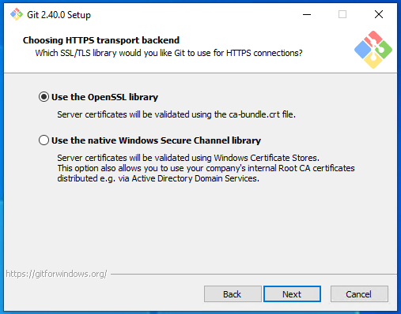

# Setting Up Git (Windows)
## A step by step guide to downloading and installing Git for your computer
## [Download this application](https://git-scm.com/download/win) and run the executable
### Make sure you have Visual Studio Code Downloaded first!

### Make sure you change this setting so it uses VSC instead of Vim

Finally click install and let it finish, then click `Finish`