# Setting Up Visual Studio Code (Windows)
## A step by step guide to downloading and installing VSC for your computer
### [First click here to download it](https://code.visualstudio.com/download)
Accept the agreement

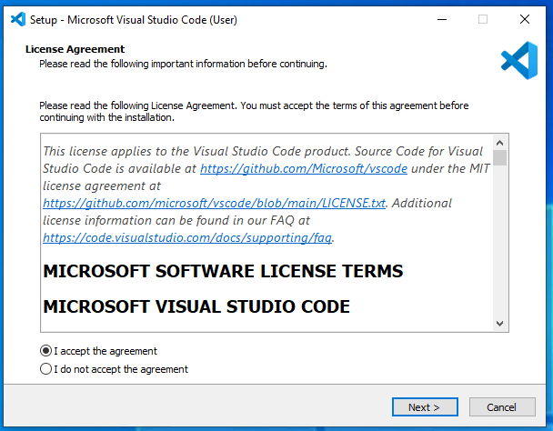
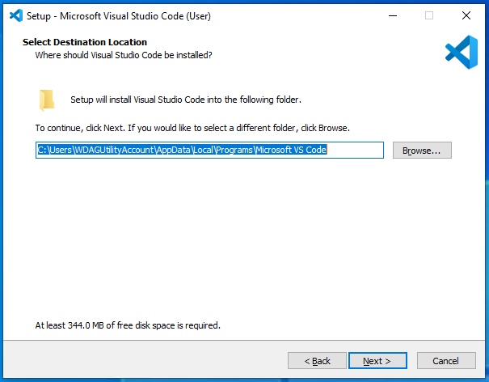
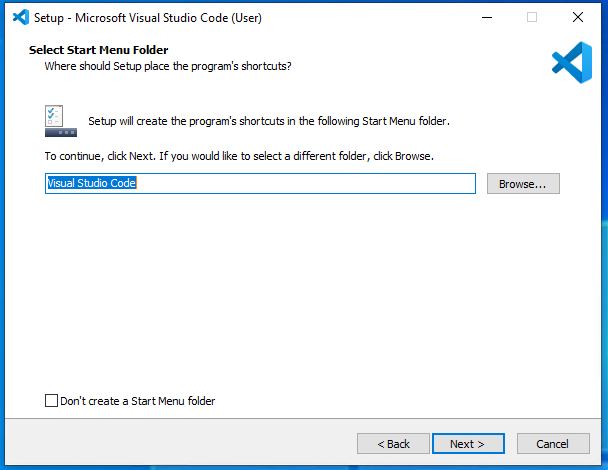

Selecting all the `Other` options will be very helpful for yourself in the future!

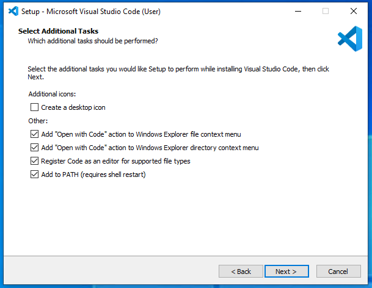
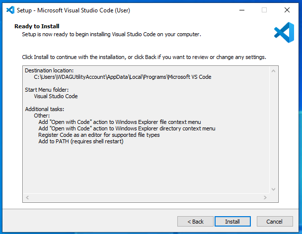

---
### When installing as finished, open VSC and you will see a page like so
You are welcome to choose whichever theme you want

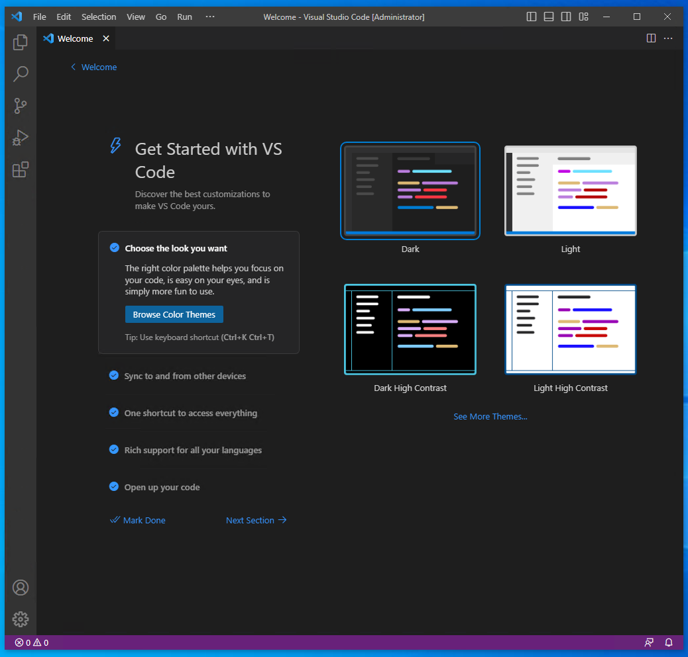
The buttons on the side are you 5 Primary tools you will use
This first one shows you everything in the current folder you have open, at the moment nothing is open so it will prompt you to open a folders

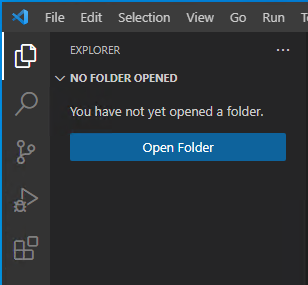

The next tool is a folder-wide search tool. This can help you search for bits of code across the entire project/repo you currently have open. You can also use this to replace small bits of code across the entire project. For example if you typo something in multiple places you can use the `Replace` field to correct it.

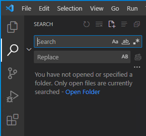

The next tool is the Git page. Right now, since I do not have a repo open, it will just show this prompt

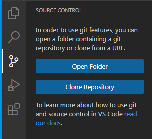

This is an example of what you could see if you did have a repo open, I have this `Documentation` repo open in VSC right now and this is what it shows me:  
So you will see an area to add a [Commit Message](https://github.com/FTC-Robotics3738/Documentation/blob/main/Github%20Basics.md) to the current changes. Underneath that is the button to create the Commit and using the little arrow button, you can push your changes from there as well.  
Beneath that is the changes from what Origin has. So you can see I have 28 changes total right now, you can also see that next to `Github Basics.md` there is an `M` next to it, that means that file has been modified.  
Below that there is `README.md` with a `U` next to it. The `U` stands for Untracked, which means Origin does not have a file for that, aka its a new file.   
Finally there's one last option that could be there, `D`. That means that Origin has the file, but you have deleted it on your local.

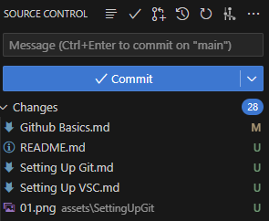

The fourth option is not too useful for us at Robotics since we need either FTC Sim to test the robot's code, or loading it onto the robot itself, so I will not be covering it here.

Finally, there is the extensions tab.  
VSC has many extensions made by many people, some are big companies like Microsoft, others are smaller companies or individual people's own creations. There are countless extensions, but for now we will get a few to make sure everyone has the same setup

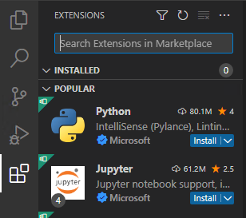

These are the extensions I want you to download for now

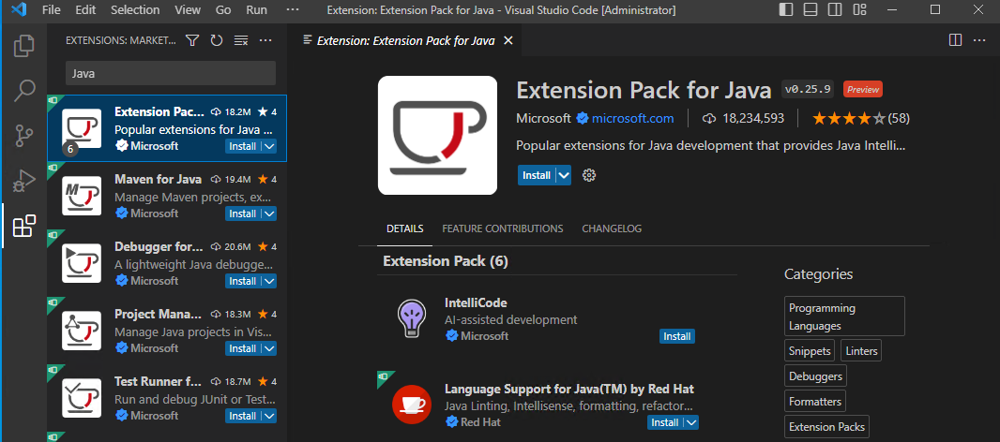

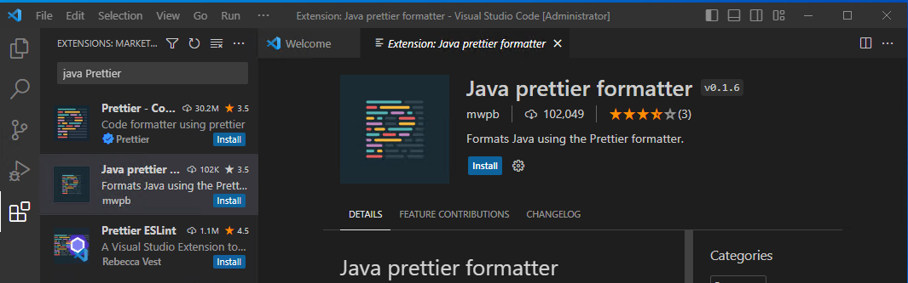

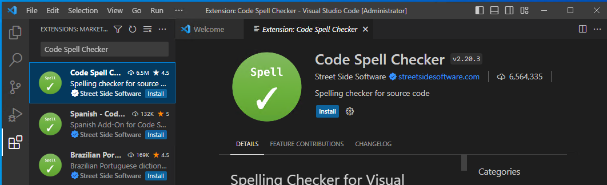

## And with that, VSC is setup!